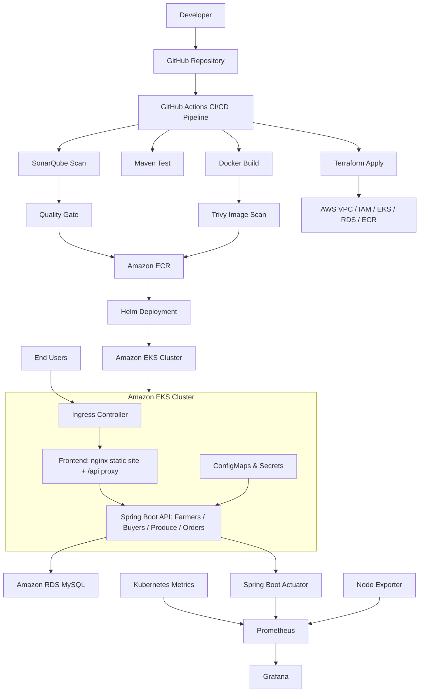
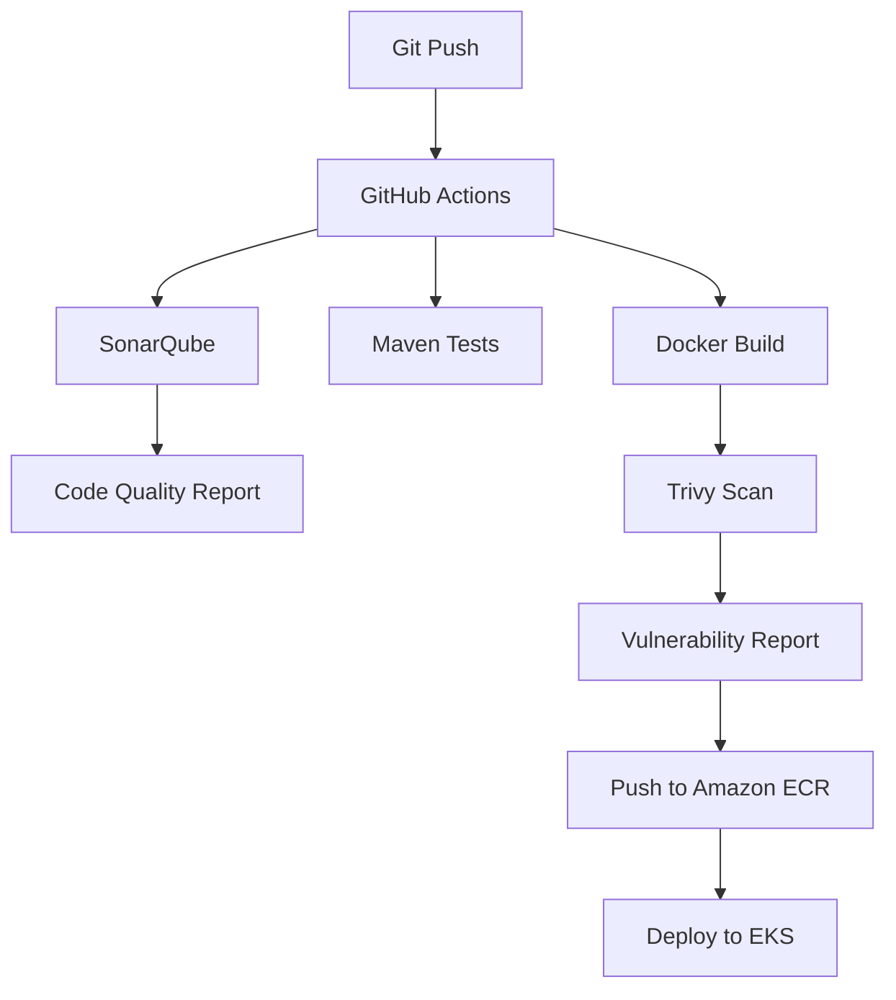

# Project Architecture

## End-to-End Architecture



## Security Pipeline



## Monitoring Flow

```mermaid
flowchart TD
    A[Spring Boot Pods] --> B[Spring Boot Actuator]
    B --> C[/actuator/prometheus]
    D[Kubernetes Metrics] --> E[Prometheus]
    F[Node Exporter] --> E
    C --> E
    E --> G[Grafana]
    G --> H[CPU / Memory / Pods / Nodes / JVM / API Metrics]
```
